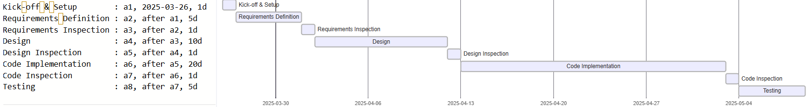

# Project Estimation

Date: 26/03/2025

Version: 1.0

# Estimation approach

Consider the GeoControl project as described in the swagger, assume that you are going to develop the project INDEPENDENT of the deadlines of the course, and from scratch

# Estimate by size

###

|                                                                                                         | Estimate |
| ------------------------------------------------------------------------------------------------------- | -------- |
| NC = Estimated number of classes to be developed  |    50      |
| A = Estimated average size per class, in LOC   |     150     |
| S = Estimated size of project, in LOC (= NC \* A)  |    7.500      |
| E = Estimated effort, in person hours (here use productivity 10 LOC per person hour)    |    750 person-hours     |
| C = Estimated cost, in euro (here use 1 person hour cost = 30 euro)   |    22.500 euro      |
| Estimated calendar time, in calendar weeks (Assume team of 4 people, 8 hours per day, 5 days per week ) |   5 weeks       |

# Estimate by product decomposition

###

| component name       | Estimated effort (person hours) |
| -------------------- | ------------------------------- |
| requirement document |     80                          |
| design document      |     120                         |
| code                 |     400                         |
| unit tests           |     120                         |
| api tests            |     80                          |
| management documents |     40                          |

# Estimate by activity decomposition

###

| Activity name           | Estimated effort (person hours) |
| ----------------------- | --------------------- |
| Kick‑off & Setup        |       32               |
| Requirements Definition |       160              |
| Requirements Inspection |       32               |
| Design                  |       320              |
| Design Inspection       |       32               |
| Code Implementation     |       640             |
| Code Inspection         |       32              |
| Testing                 |       160              |

###

# Summary

Report here the results of the three estimation approaches. The estimates may differ. Discuss here the possible reasons for the difference

|                                    | Estimated effort | Estimated duration |
| ---------------------------------- | ---------------- | ------------------ |
| estimate by size                   |      750         |     ≈5 weeks       |
| estimate by product decomposition  |      840         |     ≈6 weeks       |
| estimate by activity decomposition |      1408        |     ≈8 weeks       |

The differences among the estimates can be attributed to the nature and assumptions of each approach:

- Size-based estimation relies on general productivity assumptions (e.g., LOC per hour) and may not fully account for complexities such as communication, documentation, or quality assurance.

- Product decomposition introduces more granularity by breaking down the project into deliverables. It tends to produce a more realistic estimate than the size-based approach, especially when considering non-coding activities like documentation and testing.

- Activity decomposition is typically the most detailed and often the most accurate, as it considers specific project activities and their respective durations. This method naturally accounts for overhead tasks (e.g., inspections, setup, management), leading to a higher total effort.

In summary, the more detailed the estimation method, the higher and more realistic the total effort tends to be. The variation highlights the importance of selecting an appropriate estimation strategy based on the project’s context and criticality.